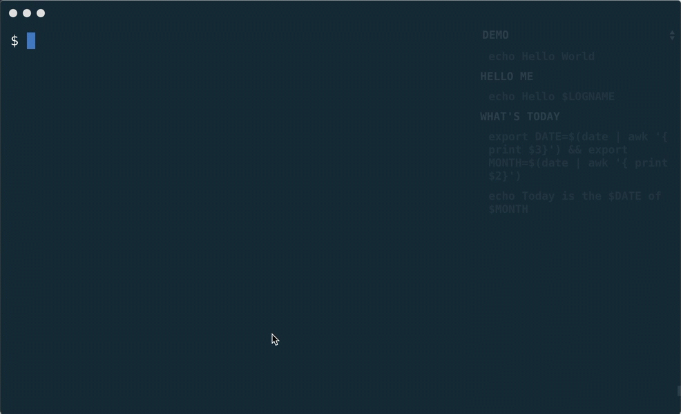

Hyper Scripts
=========

Hyper Scripts is a sidebar plugin for [Hyper](https://hyper.is/) that lists commonly used commands. Clicking a command inputs it to the terminal. Use cases include commands that are frequently used, confused or executed during a demo.

- Displays an organized, sequential list of shell commands
- Focus on your demo - not your typing skills
- Sidebar automatically mutes to fade into background



## Install

To install, edit `~/.hyper.js` and add `"hyper-scripts"` and `"hyper-active-session"` to the `plugins` list.

```javascript
plugins: [
  "hyper-active-session"
  "hyper-scripts",
],
```

## Configuration

To configure the plugin, add the following to your `config` property in `~/.hyper.js`.

```javascript
hyperscripts: {
  scripts: [
    {
      title: "Demo",
      commands: [
        "echo Hello World",
        "# hello me",
        "echo Hello $LOGNAME",
        "# what's today",
        "export DATE=$(date | awk '{ print $3}') && export MONTH=$(date | awk '{ print $2}')",
        "echo Today is the $DATE of $MONTH"
    },
    ...
  ]
}
```

Each object in `scripts` has the following properties:

- `title` - Text displayed in select element to switch between scripts
- `commands` - List of commands; commands prefix with # are used to group similar commands and do not execute